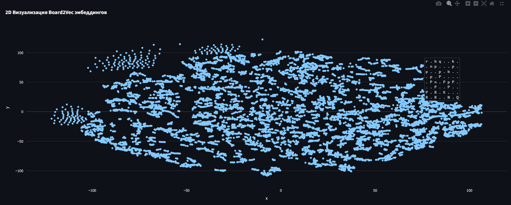

Взяв за основу архитектуру нейросети, которая оценивает позицию на листах дерева игры внутри движка Stockfish, а также идеей word2vec, я обучал модель предсказывать соседние позиции по указанной позиции (обучение представлений word2vec на skip-gram)

Архитектура модели: три линейных слоя с ReLU.

После обучение на датасете 240 тысяч партий, модель приобрела свойства, необходимые word2vec. Однако, глядя на результат снижения размерности с помощью t-SNE, кажется, что модель больше сконцентрировалась на том, чтобы два последовательных хода имели похожий вектор (на графике можно наблюдать последовательные линии, в которые прослеживается какая-то партия).

Так как мы хотим, чтобы эмбеддинги содержали информацию о стратегическом потенциале позиции, нужно либо изменить архитектуру модели, чтобы она умела выделять такие сложные паттерны, либо изменить процесс обучения, чтобы модель концентрировалась именно на этом.

Чтобы визуализировать эмбеддинги, нужно в `/board2vec/main.py` вставить этот код:

```python
from experiments.experiment_01.inference import board2vec
from experiments.utils.vizualize import main
import pandas as pd
import chess

# Таблицу можно скачать здесь: https://disk.yandex.ru/d/q1G0W-taR0TSxw
data_path = 'C:/path/to/full_labeled.csv'

data = pd.read_csv(data_path)
boards = []
for game in data['moves'].str.split().head(200):
    board = chess.Board()
    for move in game:
        board.push(chess.Move.from_uci(move))
        boards.append(board.copy())

# Визуализируем
main(boards, board2vec(boards))
```



