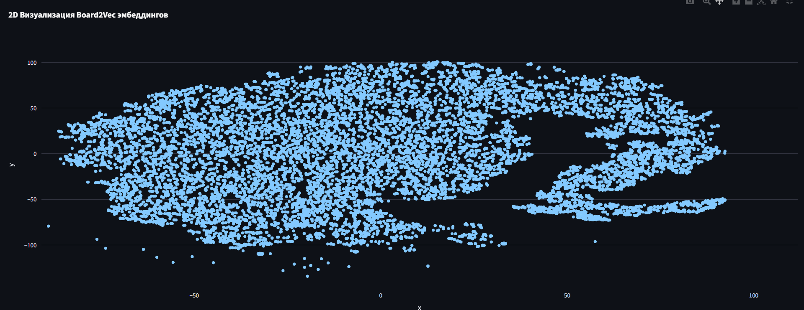

В этом эксперименте я попробовал просто изменить архитектуру модели, это три резидуальных блока, в каждом по два сверточных слоя с батчнормой.

Доска кодируется в 9 канальный тензор (6 каналов на фигуры и 3 канала на доп. информацию)

Чтобы визуализировать эмбеддинги, нужно в `/board2vec/main.py` вставить этот код:

```python
from experiments.experiment_02.inference import board2vec
from experiments.utils.vizualize import main
import pandas as pd
import chess

# Таблицу можно скачать здесь: https://disk.yandex.ru/d/q1G0W-taR0TSxw
data_path = 'C:/path/to/full_labeled.csv'

data = pd.read_csv(data_path)
boards = []
for game in data['moves'].str.split().head(200):
    board = chess.Board()
    for move in game:
        board.push(chess.Move.from_uci(move))
        boards.append(board.copy())

# Визуализируем
main(boards, board2vec(boards))
```



Скорее всего модель недообучилась, поэтому